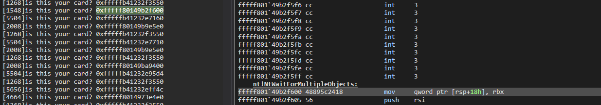
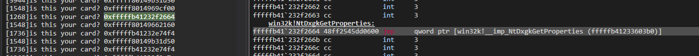
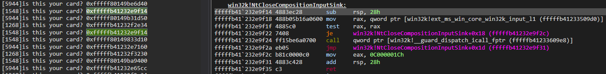

# Combining Kernel and User-Mode Hooks for Enhanced System Monitoring

This project implements techniques for both user-mode and kernel-mode system call hooking on Windows 11. 

Last tested on

```
Edition	    Windows 11 Home
Version	    23H2
OS build    22631.3593
```

**Note:** This project requires the `windows-kernel-rs` library, available
at https://github.com/carlos-al/windows-kernel-rs. After successfully building that driver, adjust the `Cargo.toml` file
to point to the correct sub-crates within the `windows-kernel-rs` library, or move the `windows-kernel-rs` library to
the appropriate location in your project structure.

## Kernel mode hooking

While the project outlined in the blog post at https://revers.engineering/fun-with-pg-compliant-hook/ provides a
foundation for our approach, we diverge in several ways. Instead of redirecting Event Tracing for Windows (ETW) logging
to `EtwpReserveWithPmcCounters`, we hijack the `EtwpReserveTraceBuffer` function.
The specific execution path taken within the pseudocode snippet below depends on the configuration of the ETW logger:

```c
    if(...) {
        if (...) {
            if (...) {
                traceBuffer = EtwpReserveWithPebsIndex(...);
            }
            if (...) {
                do {
                    if (...) {
                        traceBuffer = EtwpReserveWithPmcCounters(...);
                    }
                    ...
                } while (...);
            }
        }
        traceBuffer = EtwpReserveTraceBuffer(...);
        ...
    }
    else if (...) {
        ...
        traceBuffer = EtwpReserveTraceBuffer(...);
    }
```

Once the logger is configured to utilize the `EtwpReserveTraceBuffer` function, it receives a `WMI_LOGGER_CONTEXT`
pointer  (let's call it `logger_context`) as its first parameter. Within this structure, there's a field
named `GetCpuClock` that plays a pivotal role in how system call timing is handled. The code snippet below shows how the
value of `GetCpuClock` determines which function is called to obtain the system time. In the past, `GetCpuClock` was a
function pointer, offering a convenient point for hooking. However, in more recent Windows versions, it's now an integer
value, making the hooking process more intricate.

```c
  iVar7 = logger_context->GetCpuClock;
  if (iVar7 != 1) {
    if (iVar7 == 0) {
      lVar11 = RtlGetSystemTimePrecise();
    }
    else if (iVar7 == 2) {
      lStack_48 = 0;
      (*(code *)pHalpTimerQueryHostPerformanceCounter)(&lStack_48);
      lVar11 = lStack_48;
    }
    else {
      if (iVar7 != 3) goto LAB_1404bd2e9;
      lVar11 = rdtsc();
    }
```

By providing our own implementation of `HalpTimerQueryHostPerformanceCounter`, we can insert ourselves into the execution
flow at a critical juncture.

Given that the `hooked_hal_timer_query_host_performance_counter` function is now in place, the resulting stack trace
should resemble

```bat
fffff882`ae606ff0 fffff804`7f47a7a1     : ffffc48f`1fd5eab0 00000000`00000018 fffff882`ae607918 00000000`00000002 : driver!hooked_hal_timer_query_host_performance_counter
fffff882`ae6077b0 fffff804`7f231b78     : 00000000`00000000 00000000`00000001 00000000`00000004 fffff882`ae6078a8 : nt!EtwpReserveTraceBuffer+0x248b91
fffff882`ae607870 fffff804`7f259b77     : 00000000`00000000 ffffc48f`1685c000 00000000`00501802 fffff882`00000001 : nt!EtwpLogKernelEvent+0x3c8
fffff882`ae607920 fffff804`7f5ffd47     : ffffc48f`00000000 fffff804`7f72fc20 fffff882`ae607b20 ffffc48f`00501802 : nt!EtwTraceSiloKernelEvent+0xc7
fffff882`ae607980 fffff804`7f430d82     : ffffc48f`1edc3040 ffffc48f`1685c000 00000000`00000f34 00007ffa`00501802 : nt!PerfInfoLogSysCallEntry+0x67
fffff882`ae6079e0 00007ffa`3a1f2304     : 00007ffa`10055d57 00000232`b0512080 00000000`00000000 00000232`909b0000 : nt!KiSystemServiceExitPico+0x446
000000e2`facfe228 00007ffa`10055d57     : 00000232`b0512080 00000000`00000000 00000232`909b0000 00007ffa`3a28ccb0 : ntdll!NtQueryEaFile+0x14
000000e2`facfe230 00000232`b0512080     : 00000000`00000000 00000232`909b0000 00007ffa`3a28ccb0 00000000`00000000 : mpengine+0x145d57
000000e2`facfe238 00000000`00000000     : 00000232`909b0000 00007ffa`3a28ccb0 00000000`00000000 00000000`00000000 : 0x00000232`b0512080
```

However, this alone wouldn't be enough to hook the actual system call. The intercepted execution would simply resume as
usual after the replaced `HalpTimerQueryHostPerformanceCounter` function finishes. The key lies in the fact that the
kernel function address associated with the system call is conveniently passed on the stack. During our interception, we
can examine the stack and, if it's a system call we want to hook, swap out the original function address with our own
modified version.
Fortunately, the eventual kernel function address associated with the syscall is passed down on the stack. During the
interception we replace (if appropriate) the value on the stack with our hooked replacement.

 ```rust
unsafe extern "C" fn hooked_hal_timer_query_host_performance_counter(arg1: *mut ULONGLONG) -> LONG {
    let res = transmute::<*mut usize, HalTimerQueryHostPerformanceCounter>(
        ORIGINAL_HAL_TIMER_QUERY_HOST_PERFORMANCE_COUNTER.load(Ordering::Acquire),
    )
        .unwrap_unchecked()(arg1);

    let hook_id = *((arg1 as *const u32).offset(10));
    if hook_id == 0x00501802 {
        let backtrace = stack_trace_64(); //reimplementation of dbghelp!StackTrace64
        if backtrace.len() <= 3 {
            return res;
        }
        let frame = &backtrace[3];
        let next_frame = &backtrace[4];

        for j in 0..((next_frame.rsp as u64 - frame.rsp as u64) / 8) {
            if *((frame.rsp as *mut u32).offset((j + 2) as isize)) == 0x00501802
                && *((frame.rsp as *mut u32).offset(j as isize)) & 0xFFFF == 0xf33
            {
                let target = *(next_frame.rsp.offset(8) as *mut *mut usize);
                //println!("is this your card? 0x{:x}", target as usize);
                //KeBugCheck(0xdeadbeef);
                if target == TARGET.load(Ordering::Acquire) {
                    *(next_frame.rsp.offset(8) as *mut *mut usize) =
                        HOOK_TARGET.load(Ordering::Acquire);
                }
                break;
            }
        }
    }

    res
}
```

It looks at the stack trace and checking for special magic values linked to calls made by `PerfInfoLogSysCallEntry`
to `EtwTraceSiloKernelEvent`. Different callers of `EtwTraceSiloKernelEvent` will use different values. These values
could vary across different versions of Windows.

The images show us what functions correspond to the printed values (if uncommenting the above `println!()`):




The images show us that Win32k syscalls can be spotted and potentially hooked using this method:





The sample `ntosrnl.exe` syscall hook provided just `println!()`s its name to evidence we have intercepted the
execution:


## DLL Injection via Kernel APCs

Leveraging Kernel APCs (KAPCs) for DLL injection is a well-established technique, and our implementation draws
inspiration from the excellent work of Dennis A. Babkin, detailed in his blog post and accompanying 16-hour video
tutorial (see links below).

The 22-year-old article "Inside NT's Asynchronous Procedure Call" (archived on Dennis' site) still offers valuable
insights into the inner workings of KAPCs, along with information on "Windows Vista APC Internals" (archived under the
same link below). We also conducted some reverse engineering of relevant functions to verify the accuracy of the
information presented.

Our implementation primarily focuses on "thunkless" injection, although the project also contains some remnants of
alternative approaches, including both per-process ID injection and "thunk-some" injection. The nuances between these
methods are explored in the "Deep Hooks: Monitoring Native Execution in WoW64 Applications" series linked below.

Regarding PPL, while merely having a `KnownDll` section is no longer sufficient for injection, injection into PP/PPL
processes is still possible. While the current codebase doesn't actively pursue this and has been purged to remove most
of its implementation, traces remain within the project with some key components still present.

**Relevant Links:**

Dennis A. Babkin's Blog Post: https://dennisbabkin.com/blog/?i=AAA10800

Inside NT's Asynchronous Procedure Call & Windows Vista APC Internals: https://dennisbabkin.com/inside_nt_apc/

Deep Hooks: Monitoring Native Execution in WoW64 Applications (Part
1): https://www.sentinelone.com/blog/deep-hooks-monitoring-native-execution-wow64-applications-part-1

Deep Hooks: Monitoring Native Execution in WoW64 Applications (Part
2): https://www.sentinelone.com/blog/deep-hooks-monitoring-native-execution-wow64-applications-part-2

Deep Hooks: Monitoring Native Execution in WoW64 Applications (Part
3): https://www.sentinelone.com/blog/deep-hooks-monitoring-native-execution-wow64-applications-part-3

Bypassing PPL in Userland (Again): https://blog.scrt.ch/2023/03/17/bypassing-ppl-in-userland-again/

Bypassing EDRs with EDR-Preload: https://malwaretech.com/2024/02/bypassing-edrs-with-edr-preload.html

https://x.com/depletionmode/status/1656019243865972770